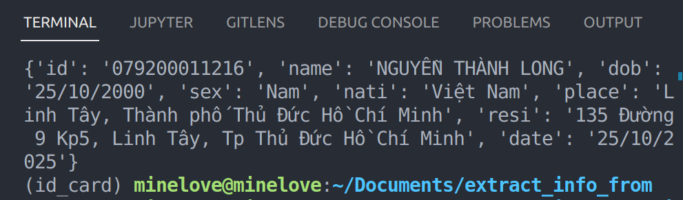

# Extract new Vietnamese ID Card from image use YOLOv7 and VietOCR

The idea of my project's pipeline is from: 
>https://fpt.ai/technical-view-fvi-end-end-vietnamese-id-card-ocr

## Step 1: Prepare 
1.0. (Optional) Create virtual environment use Anaconda

`conda create -n id_card`
`conda activate id_card`

1.1. Install requirement library

`pip install -r requirements.txt`

1.2. Download weight

There are 3 weight `.pth` files in this folder. Unrar/zip them if necessary.

Download link:
>https://bit.ly/3FeLgHl

## Step 2.1: Run local files without API

You can change the path of the image that need to extract information in `detect.py`:

`image = cv2.imread(__your path here__)` 

The result will appear in terminal. You can also modify the output (save to `.json` file, etc) in `detect.py` too. Notify, the output type of data is `dict`.

Result: 

## Step 2.2: Run online files with API

Run file `call.py`. You can access the API via 
>http://127.0.0.1:5000/api/v1/extract_in4

Use the method `POST`, and the body of the `.json` must be like:

`{
  "img_url": "__your link here__"
}`

Result: 

### Hope my small project could help you!

*from minelove with love*

